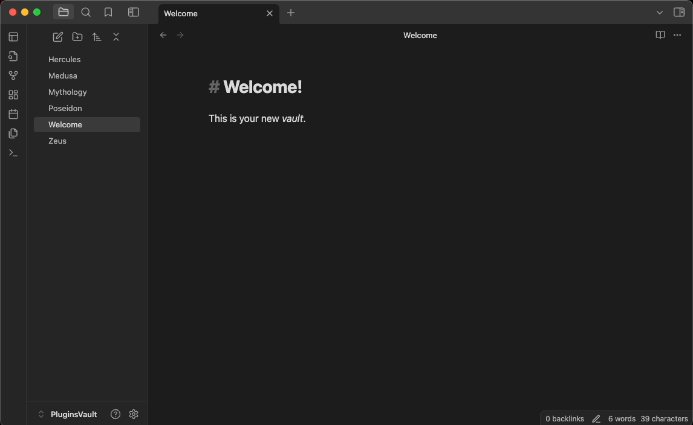
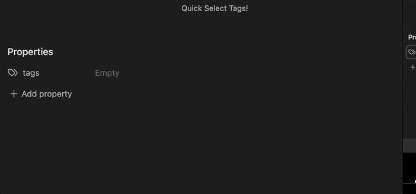
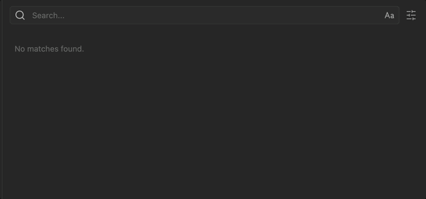
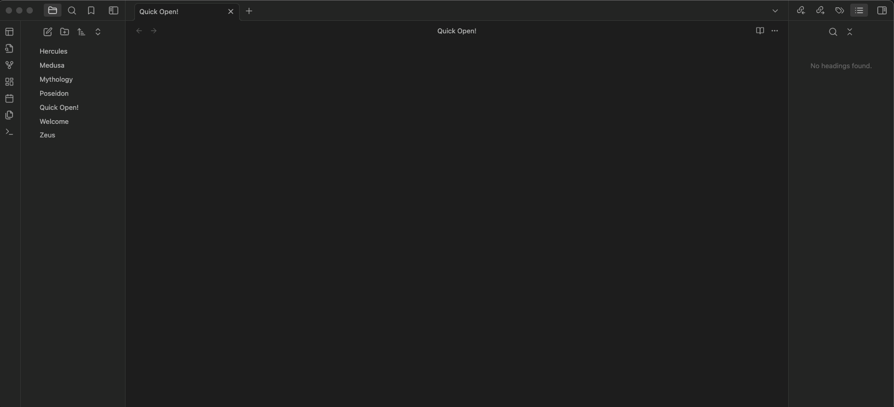
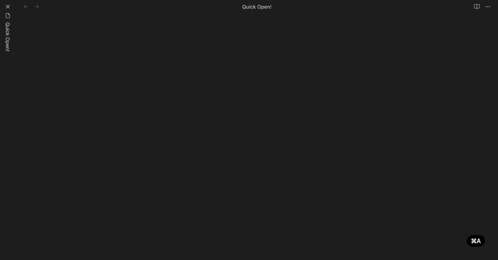

<h1>Obsidian Quick Select</h1>

Open any Obsidian modal and press <kbd>Mod</kbd> + number</kbd> to quickly open that file/execute that command/select that tag/choose that suggestion!

## Supercharge Your Workflow!

Quick Select works in all Obsidian modals including: the quick switcher, command palette (including all subsequent modals), slash command, search, even tags and alias!

### Examples:

#### Quick Select Tags (Frontmatter/Inline)

#### Quick Select Search Items

#### Hot Swap Workspaces

#### Quick Select Slash Commands

And much more...

---

### Mod Key Usage

- MacOS: <kbd>Command</kbd> + number
- Windows + Linux: <kbd>Ctrl</kbd> + number

---

This project is licensed under the terms of the MIT license.
